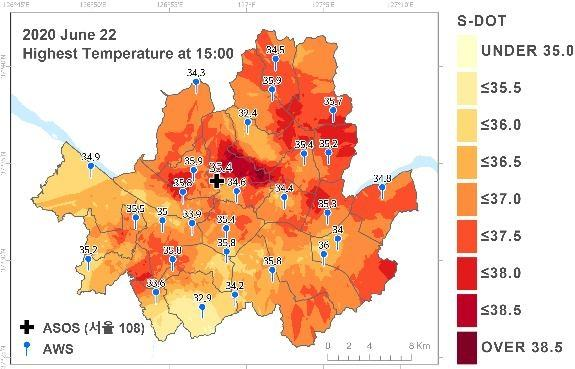
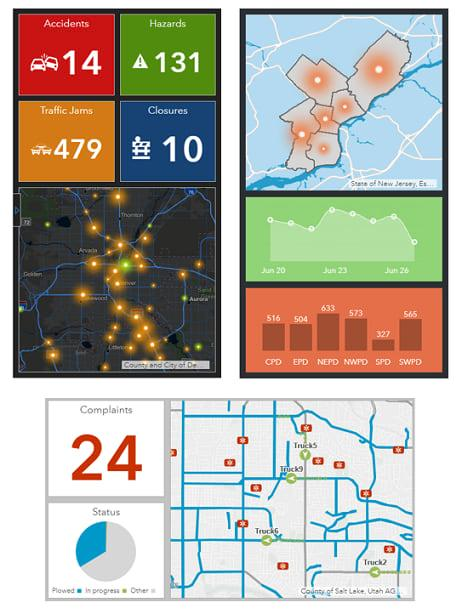
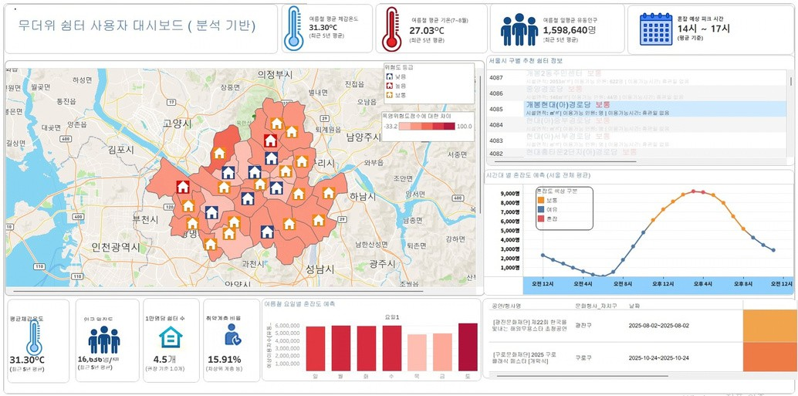
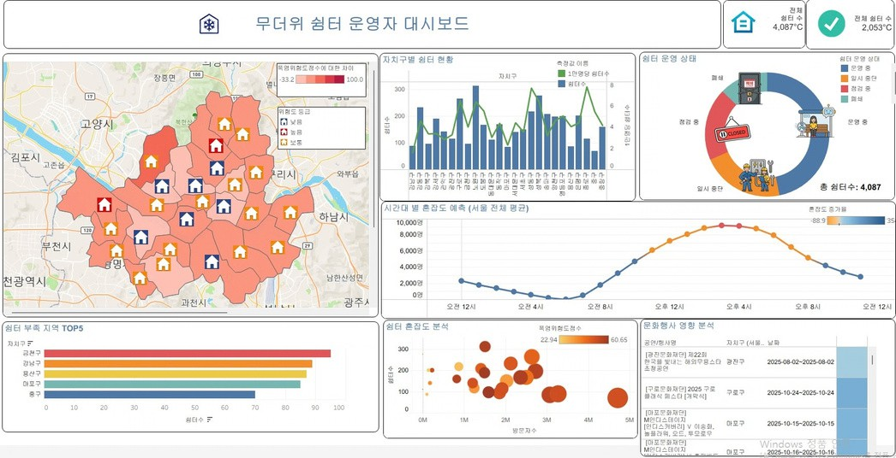
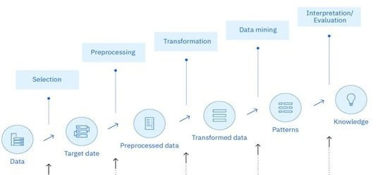
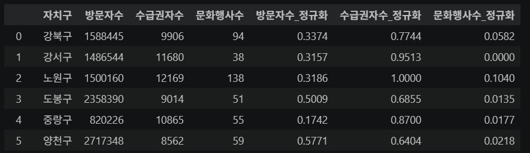
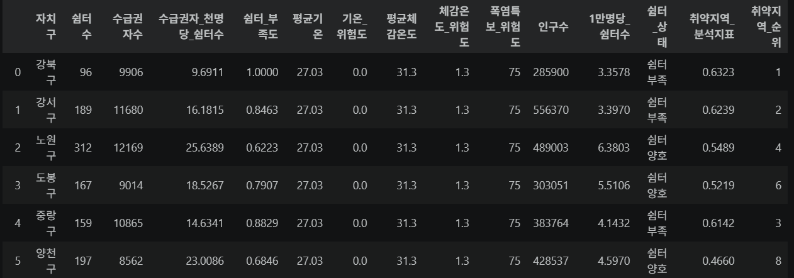
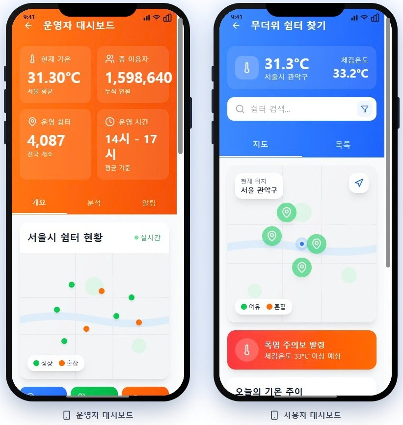

# 폭염 대응 무더위쉼터 이용 최적화 및 의사결정 지원 대시보드

빅데이터 시각적 분석 팀 프로젝트로, 팀이 직접 수집한 서울시 무더위쉼터, 기상, 인구, 취약계층, 유동인구, 문화행사 데이터를 결합하여 폭염 위험도와 쉼터 이용 수요를 분석한 Tableau 대시보드 프로젝트입니다.

## 프로젝트 개요

최근 폭염의 빈도와 지속 기간이 증가하면서 온열질환과 폭염 취약계층 보호 문제가 중요해지고 있습니다. 무더위쉼터는 폭염 대응을 위한 공공 복지 시설이지만, 단순 위치 정보나 시설 수 중심의 관리만으로는 실제 이용 수요, 혼잡도, 지역별 취약성을 충분히 반영하기 어렵습니다.

본 프로젝트는 데이터 기반으로 지역별 폭염 위험도와 쉼터 공급 수준을 분석하고, 사용자와 운영자가 각각 필요한 정보를 확인할 수 있는 시각화 대시보드를 제작하는 것을 목표로 합니다.

### 분석 배경 및 필요성



기후변화로 인해 폭염 발생 빈도와 지속 기간이 증가하면서 온열질환, 취약계층 보호, 지역별 폭염 대응 역량의 차이가 중요한 사회 문제로 부각되고 있습니다. 무더위쉼터는 폭염 대응을 위한 핵심 공공시설이지만, 기존의 시설 수와 위치 중심 관리는 실제 이용 수요, 취약계층 분포, 유동인구, 기상 위험을 충분히 반영하기 어렵습니다. 따라서 지역별 위험 요인을 통합 분석하고 쉼터 부족 지역을 식별할 수 있는 데이터 기반 의사결정 체계가 필요합니다.

### 분석 목적



본 분석은 기상, 인구, 취약계층, 유동인구, 문화행사, 무더위쉼터 데이터를 통합하여 자치구별 폭염 위험도와 쉼터 이용 수요를 도출하는 것을 목적으로 합니다. 시민에게는 주변 쉼터 탐색과 위험 정보 확인을 지원하고, 운영자에게는 쉼터 부족 지역, 취약지역, 우선 대응 지역을 판단할 수 있는 근거를 제공합니다.

## 팀 정보

- 팀명: 1조 분석하조
- 주제: 복지 데이터를 활용한 폭염 대응 무더위쉼터 이용 최적화 및 의사결정 지원
- 도구: Tableau, Python/Jupyter Notebook, CSV 데이터 전처리

## 주요 목표

- 공공데이터 포털 및 통계 자료 기반 데이터 직접 수집
- 서울시 자치구별 폭염 위험도 산출
- 쉼터 수, 취약계층 규모, 유동인구, 기온, 체감온도, 폭염특보 등 복합 요인 분석
- 사용자 관점의 최적 무더위쉼터 탐색 지원
- 운영자 관점의 쉼터 부족 지역, 위험 지역, 우선 대응 지역 식별
- 폭염 대응 정책과 현장 운영을 위한 데이터 기반 의사결정 지원

## 대시보드 구성

### 사용자 대시보드

파일: `시각화/사용자_대시보드.twbx`



사용자가 폭염 상황에서 이용 가능한 쉼터 정보를 탐색하고, 지역별 위험도와 주변 여건을 고려해 적절한 쉼터를 선택할 수 있도록 설계한 대시보드입니다.

주요 기능:

- 지역별 무더위쉼터 현황 확인
- 폭염 위험도 및 쉼터 부족도 기반 지역 비교
- 유동인구와 기상 요인을 반영한 이용 수요 파악
- 사용자 위치 또는 관심 지역 기준 쉼터 탐색 지원

### 운영자 대시보드

파일: `시각화/운영자_대시보드 .twbx`



운영자와 정책 담당자가 자치구별 폭염 위험도, 쉼터 공급 수준, 취약계층 분포를 함께 확인하여 쉼터 운영과 추가 배치 우선순위를 판단할 수 있도록 구성한 대시보드입니다.

주요 기능:

- 자치구별 폭염 위험도 점수 및 위험등급 확인
- 쉼터 부족 지역 및 우선순위 분석
- 수급권자, 방문자 수, 인구수, 기온, 폭염특보 등 지표 비교
- 신규 쉼터 설치, 운영 시간 연장, 인력 배치 등 의사결정 지원

## 분석 방법

본 프로젝트는 KDD 방법론을 기반으로 진행했습니다.



1. 데이터 선택: 팀이 서울시 공공데이터, 통계 데이터, 기상 데이터 등 프로젝트 목적에 맞는 자료를 직접 수집
2. 데이터 전처리: 결측치 및 중복 제거, 자치구명 기준 통합, 변수명 및 형식 정리
3. 데이터 변환: 방문자 수, 수급권자 수, 문화행사 수 등 주요 변수를 정규화
4. 데이터 마이닝: 폭염 위험도 점수, 쉼터 부족도, 취약지역 분석 지표 생성
5. 결과 해석 및 활용: Tableau 대시보드로 사용자용/운영자용 시각화 자료 제작

### 데이터 변환

데이터 간 단위 차이를 제거하고 분석 정확도를 높이기 위해 데이터 변환 작업을 수행했습니다. 방문자 수, 수급권자 수, 문화행사 수는 Min-Max 정규화를 적용하여 0~1 범위로 변환했습니다.



또한 쉼터 공급 수준을 반영하기 위해 수급권자 천 명당 쉼터 수를 계산했으며, 이를 정규화한 뒤 쉼터가 부족할수록 높은 위험도를 나타내도록 역변환하여 쉼터 부족도 지표를 생성했습니다. 기온 및 체감온도는 폭염 기준인 30℃를 초과하는 정도를 기준으로 위험도를 산출했으며, 폭염특보 데이터는 폭염주의보와 폭염경보의 가중치를 반영하여 위험도 값으로 변환했습니다.

운영자 대시보드에 활용하기 위해 인구 1만 명당 쉼터 수, 쉼터 부족 지역, 취약지역 분석 지표도 추가로 생성했습니다.



## 폭염 위험도 지표

폭염 위험도는 다음 요인을 결합해 산출했습니다.

- 방문자 수
- 수급권자 수
- 문화행사 수
- 쉼터 부족도
- 기온 위험도
- 체감온도 위험도
- 폭염특보 위험도

최종 폭염 위험도 점수는 방문자 수 20%, 수급권자 수 20%, 문화행사 수 10%, 쉼터 부족도 20%, 기온·체감온도 위험도 15%, 폭염특보 위험도 15%를 반영하여 산출했습니다.

```text
y = (0.20V + 0.20B + 0.10C + 0.20S + 0.15T + 0.15H) * 100
```

변수 의미:

- V: 방문자 수 정규화 지표
- B: 취약계층 또는 수급권자 관련 정규화 지표
- C: 문화행사 관련 지표
- S: 쉼터 부족도
- T: 기온 위험도
- H: 체감온도 또는 폭염특보 관련 위험도

가중치는 선행연구에서 제시된 폭염 취약요인과 정책적 중요도를 고려하여 설정했습니다. 방문자 수와 수급권자 수는 폭염 노출 인구 및 취약계층 규모를 나타내는 핵심 변수로 판단하여 높은 비중을 부여했으며, 쉼터 부족도는 지역의 폭염 대응 역량을 반영하기 위해 동일한 수준으로 반영했습니다. 기온·체감온도와 폭염특보는 폭염 자체의 위험성을 나타내는 기상 요인으로 고려했고, 문화행사 수는 유동인구 증가에 따른 폭염 노출 가능성을 반영하기 위해 포함했습니다.

가중치 설정에 따른 결과의 신뢰성을 검토하기 위해 민감도 분석을 수행했습니다. 일부 변수의 가중치를 조정한 후 위험도 순위를 비교한 결과, 폭염 위험도 상위 5개 자치구가 모두 동일하게 유지되었으며 TOP5 유지율은 100%로 나타났습니다. 이는 가중치가 일정 범위 내에서 변경되더라도 주요 위험지역 선정 결과가 크게 달라지지 않음을 의미합니다.

문화행사 데이터는 행사별 실제 관람객 수 데이터가 존재하지 않아 자치구별 행사 집중도를 활용했습니다. 행사 기간 동안의 일평균 동시 진행 행사 수와 평상시 일평균 행사 수를 비교하여 혼잡도 증가율을 산출했으며, 이를 통해 특정 기간의 무더위쉼터 이용 수요 증가 가능성을 분석했습니다.

산출된 폭염 위험도 점수와 혼잡도 증가율을 활용하여 자치구별 위험 수준을 비교하고, 폭염 취약지역 및 쉼터 부족 지역을 도출했습니다.

## 데이터 구성

```text
팀프로젝트/
├── assets/
│   ├── analysis-background.png
│   ├── analysis-process.jpg
│   ├── analysis-purpose.png
│   ├── user-dashboard.jpg
│   ├── operator-dashboard.jpg
│   ├── normalized-data-table.png
│   ├── risk-indicator-table.png
│   └── app-commercialization-prototype.jpg
├── 데이터/
│   ├── 원본_데이터/
│   └── 전처리_데이터/
├── 시각화/
│   ├── 사용자_대시보드.twbx
│   └── 운영자_대시보드 .twbx
├── 조사자료/
├── 1조_무더위 쉼터 대시보드 PPT 수정본.pptx
└── README.md
```

주요 전처리 데이터:

| 파일명                                       | 주요 내용                                                                |
| -------------------------------------------- | ------------------------------------------------------------------------ |
| `폭염_위험도_점수표_지표추가.csv`            | 자치구별 폭염위험도점수, 위험등급, 쉼터수, 기온, 체감온도, 취약지역 순위 |
| `폭염_위험도_점수표.csv`                     | 자치구별 폭염 위험도와 쉼터 부족 순위                                    |
| `서울시_자치구별_쉼터수(전처리).csv`         | 자치구별 무더위쉼터 수                                                   |
| `서울시_인구밀도_전처리.csv`                 | 자치구별 인구, 면적, 인구밀도                                            |
| `자치구별 방문자수(전처리).csv`              | 시간대 및 자치구 기준 방문자 수                                          |
| `시군구 별 가구수 및 수급권자수(전처리).csv` | 자치구별 가구수 및 수급권자 수                                           |
| `폭염특보 데이터(전처리).csv`                | 폭염특보 발표 및 상태 정보                                               |
| `전처리.ipynb`                               | 데이터 정제, 통합, 지표 생성 과정                                        |

참고: 일부 CSV는 실행 환경에 따라 한글 인코딩이 깨져 보일 수 있으므로 Tableau 또는 Python에서 불러올 때 `cp949`, `euc-kr`, `utf-8-sig` 인코딩을 확인해야 합니다.

## 원본 데이터

활용 데이터는 팀이 서울시 공공데이터 포털과 통계 자료를 직접 탐색하고 수집하여 구성했습니다.

- 서울시 무더위쉼터
- 스마트서울 도시데이터 센서 유동인구 측정 정보
- 서울시 폭염특보 및 기온 데이터
- 서울시 여름 체감온도 데이터
- 서울시 자치구별 인구밀도
- 서울특별시 차상위계층 동별 연령별 현황
- 서울시 문화행사 정보

## 실행 및 확인 방법

1. Tableau Desktop 또는 Tableau Reader를 설치합니다.
2. `시각화/사용자_대시보드.twbx` 파일을 열어 사용자용 대시보드를 확인합니다.
3. `시각화/운영자_대시보드 .twbx` 파일을 열어 운영자용 대시보드를 확인합니다.
4. 데이터 전처리 과정을 확인하려면 `데이터/전처리_데이터/전처리.ipynb`를 실행합니다.
5. 발표 흐름은 `1조_무더위 쉼터 대시보드 PPT 수정본.pptx`에서 확인할 수 있습니다.

## 발표 자료 구성

발표 자료는 다음 흐름으로 구성되어 있습니다.

1. 분석 배경
2. 분석 목적
3. 분석 절차
4. 데이터 수집
5. 데이터 전처리 및 변환
6. 데이터 마이닝
7. 사용자 대시보드
8. 운영자 대시보드
9. 분석 결과 정리
10. 앱 상용화 프로토타입

## 분석 결과 요약

- 폭염 위험도는 단순 기온뿐 아니라 취약계층 밀집도, 유동인구, 쉼터 공급 수준이 복합적으로 작용해 결정됩니다.
- 수급권자 비율과 유동인구가 높지만 쉼터 공급이 부족한 자치구는 폭염 대응 사각지대로 볼 수 있습니다.
- 쉼터 운영은 시설 수 중심 관리에서 지역별 수요와 취약성을 고려한 맞춤형 운영으로 전환할 필요가 있습니다.
- 문화행사 등 유동인구가 증가하는 시기에는 쉼터 혼잡도와 이용 수요가 함께 증가할 수 있으므로 선제적인 운영 전략이 필요합니다.
- 민감도 분석 결과, 가중치 변경에도 상위 위험 지역이 유지되어 지표의 안정성을 확인했습니다.

### Prototype for App Commercialization



분석 결과는 Tableau 대시보드에 그치지 않고 앱 상용화 프로토타입으로 확장할 수 있습니다. 사용자 화면은 현재 위치 또는 관심 지역을 기준으로 주변 무더위쉼터를 탐색하고, 거리, 온도, 수용률, 위험도 정보를 함께 확인하도록 설계했습니다. 운영자 화면은 실시간 쉼터 현황, 이용자 수, 운영 시간, 위험 알림을 확인하여 폭염 대응 운영 판단에 활용할 수 있도록 구성했습니다.

Figma 프로토타입: [Prototype for App Commercialization](https://www.figma.com/make/wWwpKCf1SAWYYXBPTlTqzb/Prototype-for-App-Commercialization?code-node-id=0-9&p=f&t=roBWlyNrJMvASXGb-0&fullscreen=1)

## 기대 효과

- 시민: 폭염 상황에서 접근 가능한 쉼터와 위험 지역 정보를 빠르게 확인
- 운영자: 쉼터 부족 지역, 위험 지역, 인력 배치 필요 지역을 근거 기반으로 판단
- 정책 담당자: 신규 쉼터 설치, 운영 시간 조정, 폭염 대응 예산 배분의 우선순위 설정

## 한계 및 개선 방향

- 실제 쉼터별 실시간 이용 인원 데이터가 부족하여 혼잡도는 추정 지표 중심으로 구성되었습니다.
- 일부 데이터는 수집 시점과 갱신 주기가 달라 최신성 차이가 발생할 수 있습니다.
- 향후 실시간 위치 정보, 쉼터 운영 상태, 냉방 여부, 접근성 정보가 추가되면 사용자 추천 정확도를 높일 수 있습니다.
- 장애인, 고령자 등 이동 취약계층의 접근성 지표를 별도로 반영하면 복지 정책 활용성이 높아질 수 있습니다.
